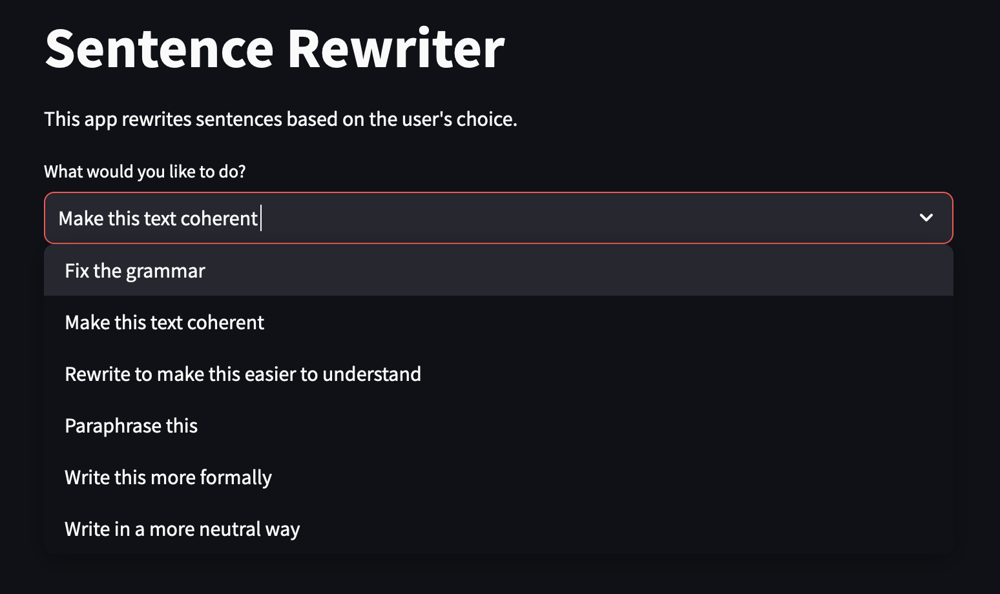
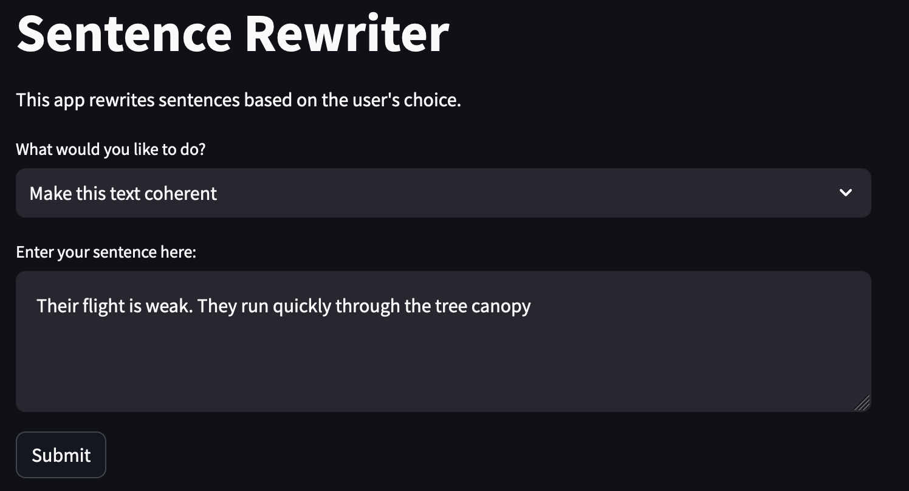
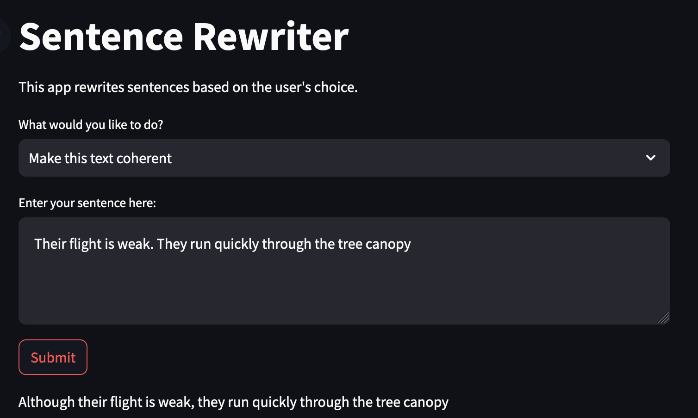
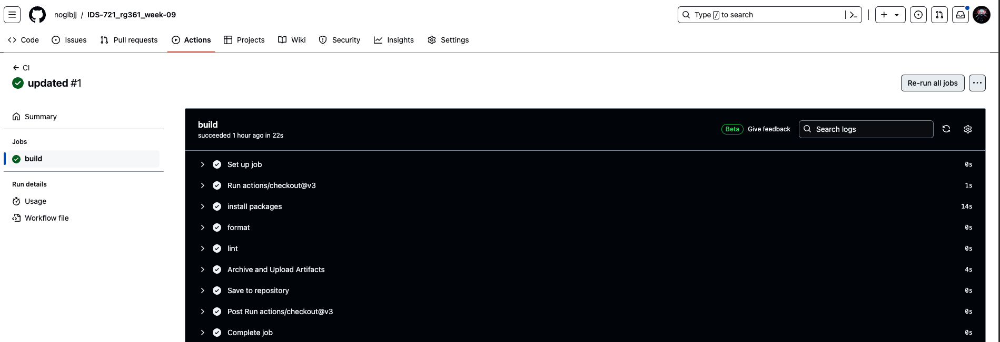

# Streamlit App with Hugging Face Model

[](https://github.com/nogibjj/IDS-721_rg361_week-09/actions/workflows/cicd.yml)

In this project [streamlit](https://streamlit.io/) is used to create a simple web app that uses a pre-trained model from [Hugging Face](https://huggingface.co/). The app takes in a sentence from the user and modifies it according to the seletion made by the user.

The app is deployed on the following 2 services:
1. Streamlit : [Link]
2. AWS EC2: [Link]

Note: 
- AWS EC2 might not work at the time you are viewing this repo as the instance may be stopped due to cost reasons.
- The app might also not work if HuggingFace is down, check the status of HuggingFace [here](https://status.huggingface.co/) before using the app.

## Overview

The app which was built using streamlit acts as a simple interface between the user and the back-end hugging face model. The app takes care of processing and formatting the input from the user and converts it into a format that the model can understand. It also processes the output from the model and displays it in a user-friendly format.

The model used for this demo is the [grammarly-coedit-large](https://huggingface.co/grammarly/coedit-large) model from Hugging Face. The model is a text correction model that can be used to correct the grammar and style of the text.

## Instructions For App Usage:
1. use the app from the desired sources [local, aws ec2, streamlit]
2. choose the desired modification option from the dropdown  
  
3. enter the sentence in the text box
4. click on the "Submit" button  
  
5. the modified sentence will be displayed  
  

## Instructions for Local Testing:

1. clone this repository to your local machine
2. install the required packages using the following command:
```bash
pip install -r requirements.txt
```
3. run the app using the following command:
```bash
streamlit run app.py
```
4. you can access the app with any browser using the 8501 port with the address `http://localhost:8501`

## App Deployment Process:

As mentioned earlier, the app was also deployed on AWS EC2 and Streamlit, a brief overview of the deployment process is given below

### AWS EC2 Deployment:
1. Create an AWS EC2 instance, make sure it:
    - has sufficient resources to run the app
    - allows inbound and outbound connections
2. Once the instance is created, under the security group setting, add a new rule to allow inbound traffic on port 8501 (this is the port which streamlit uses)
3. connect to the instance and update the instance using the following commands:
```bash
sudo apt-get update
sudo apt-get upgrade
```
4. Clone the repository into the instance and install the required packages as mentioned in the local testing section
5. run the following command to run the app on the instance:
```bash
nohup python3 -m streamlit run app.py
```
6. The app can be accessed using the public IP of the instance with the port 8501

### Streamlit Deployment:
1. Create a streamlit account in case you don't have one
2. click on the new app button and select the repository from the list of repositories
3. click on the deploy button to deploy the app
4. the app can be accessed using the link provided by streamlit

## CI/CD Pipeline:
The CI/CD pipeline was implemented using GitHub Actions. The pipeline automatically formats and lints the code files whenever an update is made to the repository. if all the checks pass the following will be visible in the actions page:

